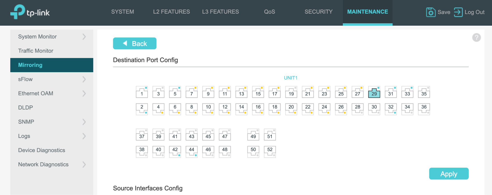
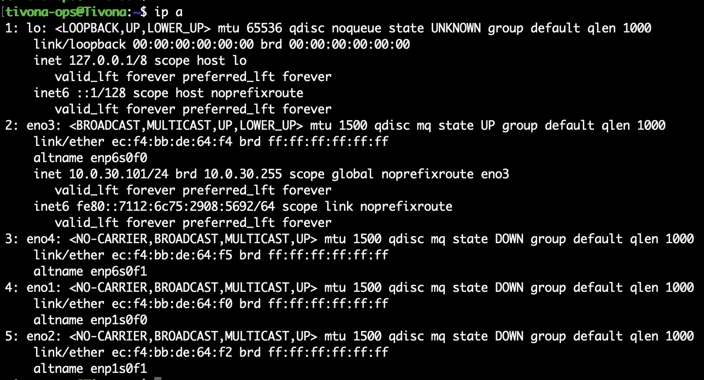
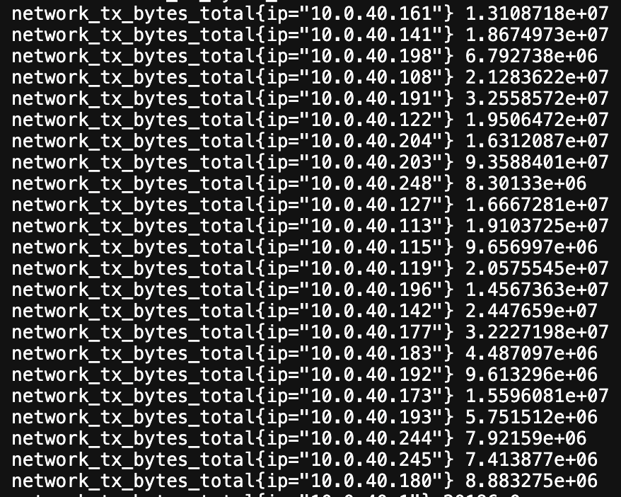
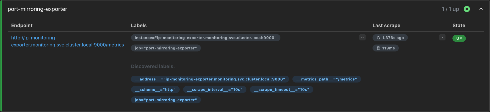
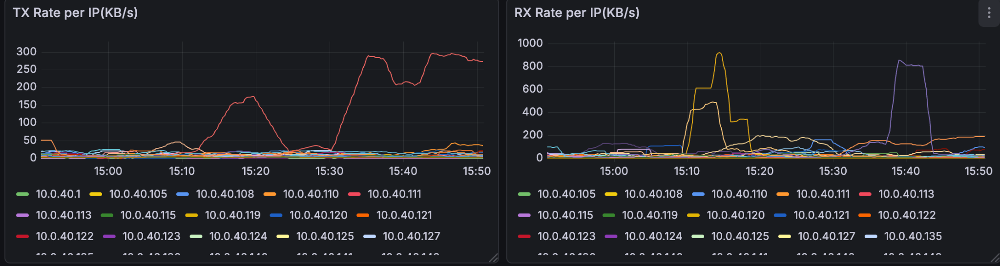
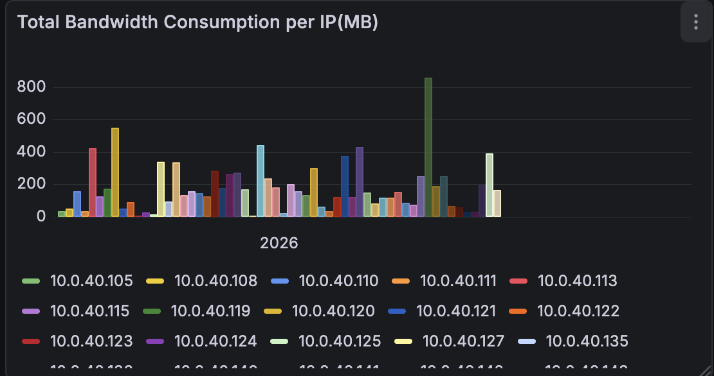
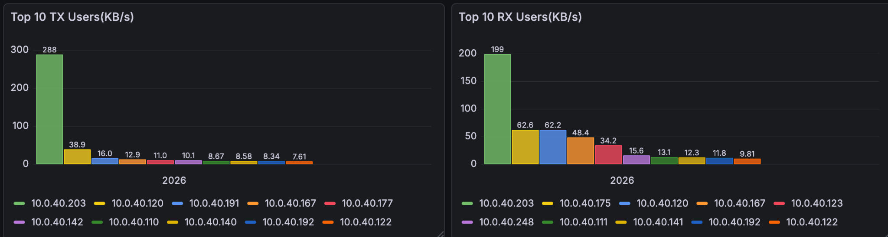

# Port Mirroring Based IP Monitoring

## Introduction

This approach follows IP network monitoring using port mirroring to capture real-time traffic at the packet level.

The network switch is configured with port mirroring, duplicating traffic from target ports and forwarding it to a monitoring server.

A custom Python exporter processes this data and exposes it through an HTTP endpoint in a Prometheus-compatible format.

To ensure scalability and portability, the exporter is containerized using Docker, pushed as an image and deployed within a Kubernetes cluster.

Prometheus then scrapes the exporter endpoint to collect and store these IP-level metrics.

Finally, Grafana integrates with Prometheus to visualize the data through dashboards, providing detailed insights into IP Network Usage patterns, and overall performance for IPs.

## Workflow

```text
Router Traffic
      ↓
TP-Link Switch (Port Mirroring)
      ↓
Dell Server (Packet Capture)
      ↓
Custom Exporter (Scapy + Prometheus)
      ↓ /metrics
Prometheus
      ↓
Grafana
      ↓
Per-IP Monitoring Dashboard
```

---

# Procedure

## Step-1 - Configure Port Mirroring on Switch

Mirror all router traffic to the monitoring server.

| Parameter | Value |
|-----------|-------|
| Source Port | Port 1 (Router uplink) |
| Destination Port | Port 2 (Server) |
| Direction | Both (Ingress + Egress) |

Source Port (**1**) → Connected to router

Destination Port (**29**) → Connected to Dell server

Direction: **Both** ensures:

- Incoming traffic (Ingress)
- Outgoing traffic (Egress)

### Switch Configuration

Login to **SG3452P Switch** and open the **Maintenance** section.

Click on **Mirroring** from the left panel.

Configure the source and destination ports as above.

This ensures all traffic flowing through the router is mirrored to the server.



---

## Step-2 - Identify Network Interface on Server

Determine which network interface is receiving mirrored traffic.

Run the command:

```bash
ip a
```

You will see multiple interfaces like below.



Identify the interface connected to switch (**Port 29**).

We have `eno3` interface connected to the Switch.

Note this interface as we use it later in the exporter configuration.

### Optional Steps

To check the generated logs:

```bash
sudo tcpdump -i eno3
```

To check the generated logs specific to an IP:

```bash
sudo tcpdump -i eno3 host <IP-Address>
```

Run this to save the logs into a file (runs in the foreground):

```bash
sudo tcpdump -i eno3 host <IP-Address> -nn > logs_ip.log
```

Run this to save the logs into a file (runs in the background):

```bash
sudo nohup tcpdump -i eno3 host <IP-Address> -nn >> logs_ip.log 2>&1 &
```


---

## Step-3 - Deploy Custom IP Traffic Exporter

This exporter config captures packets and exposes Prometheus-compatible metrics per IP.

Uses **Scapy** for packet sniffing.

Tracks:

- Bytes (TX/RX)
- Packets (TX/RX)
- Traffic rate (KB/s)

### exporter.py

```python
from scapy.all import sniff, IP
from prometheus_client import start_http_server, Counter, Gauge
import os

INTERFACE = os.getenv("INTERFACE", "eno3")
SUBNET_PREFIX = os.getenv("SUBNET_PREFIX", "10.0.40.")
PORT = int(os.getenv("EXPORTER_PORT", "9000"))
INTERVAL = int(os.getenv("INTERVAL", "5"))

tx_bytes = Counter('network_tx_bytes_total', 'TX bytes', ['ip'])
rx_bytes = Counter('network_rx_bytes_total', 'RX bytes', ['ip'])
tx_packets = Counter('network_tx_packets_total', 'TX packets', ['ip'])
rx_packets = Counter('network_rx_packets_total', 'RX packets', ['ip'])

tx_rate = Gauge('network_tx_rate_kbps', 'TX rate KB/s', ['ip'])
rx_rate = Gauge('network_rx_rate_kbps', 'RX rate KB/s', ['ip'])

import threading
import time
from collections import defaultdict

stats = defaultdict(lambda: {"txb": 0, "rxb": 0})
lock = threading.Lock()

def process_packet(pkt):
    if IP not in pkt:
        return

    src = pkt[IP].src
    dst = pkt[IP].dst
    size = len(pkt)

    with lock:
        if src.startswith(SUBNET_PREFIX):
            stats[src]["txb"] += size
            tx_bytes.labels(ip=src).inc(size)
            tx_packets.labels(ip=src).inc(1)

        if dst.startswith(SUBNET_PREFIX):
            stats[dst]["rxb"] += size
            rx_bytes.labels(ip=dst).inc(size)
```

### requirements.txt

```text
scapy
prometheus_client
```

### Dockerfile

```dockerfile
FROM python:3.12-slim

WORKDIR /app

RUN apt-get update && apt-get install -y \
    tcpdump \
    libpcap-dev \
    && rm -rf /var/lib/apt/lists/*

COPY requirements.txt .
RUN pip install --no-cache-dir -r requirements.txt

COPY exporter.py .

CMD ["python", "exporter.py"]
```


---

## Step-4 - Build & Push IP Monitoring Exporter Image

From the directory containing the above files, run:

```bash
docker build -t ip-monitoring-exporter:v2 .
```

Verify image with:

```bash
docker images
```

Tag the image with your Docker repository:

```bash
docker tag ip-monitoring-exporter:v2 <docker-repo>/ip-monitoring-exporter:v2
```

Push image to Registry:

```bash
docker push <docker-repo>/ip-monitoring-exporter:v2
```

Now you see your working image inside your Docker Hub. Based on your requirements you can upload your image to any artifact registry.


---

## Step-5 - Deploy IP Monitoring Exporter in Kubernetes

Now we will be deploying the custom exporter inside Kubernetes.

Enable packet capture from host network and then expose the metrics for Prometheus scraping.

### Create Deployment

Create the deployment file.

```yaml
apiVersion: apps/v1
kind: Deployment
metadata:
  name: ip-monitoring-exporter
  namespace: monitoring
spec:
  replicas: 1
  selector:
    matchLabels:
      app: ip-monitoring-exporter
  template:
    metadata:
      labels:
        app: ip-monitoring-exporter
    spec:
      hostNetwork: true
      dnsPolicy: ClusterFirstWithHostNet
      containers:
      - name: exporter
        image: santoshgorti/ip-monitoring-exporter:v2
        securityContext:
          privileged: true
        env:
        - name: INTERFACE
          value: "eno3"
        - name: EXPORTER_PORT
          value: "9000"
        - name: SUBNET_PREFIX
          value: "10.0.40."
        - name: INTERVAL
          value: "5"
        ports:
        - containerPort: 9000
```

### Key Configurations

| Configuration | Description |
|--------------|-------------|
| `hostNetwork: true` | Required to access host NIC (`eno3`) |
| `privileged: true` | Needed for packet sniffing (Scapy / libpcap) |
| `INTERFACE` | Must match interface identified earlier (`ip a`) |
| `SUBNET_PREFIX` | Filters only relevant IP traffic |

### Create Service

Create service file.

```yaml
apiVersion: v1
kind: Service
metadata:
  name: ip-monitoring-exporter
  namespace: monitoring
spec:
  type: NodePort
  selector:
    app: ip-monitoring-exporter
  ports:
  - port: 9000
    targetPort: 9000
    nodePort: 30090
```

### Apply Resources

```bash
kubectl apply -f ip-monitoring-deployment.yaml
kubectl apply -f ip-monitoring-service.yaml
```

### Test Metrics Endpoint

If everything runs fine, you would see metrics added at the endpoint.

Since we have added NodePort Service, you can access the metrics under:

```text
http://<SERVER-IP>:30090/metrics
```

Expected output - Prometheus Style Metrics.



---

## Step-6 - Configure Prometheus Scraping

Since we already have configured Prometheus from the previous procedures (ISP Monitoring), we'll use the same Helm-deployed Kubernetes here.

We previously ran all the monitoring resources under the namespace `monitoring`. So, we use the same namespace for the IP based monitoring deployments as well.

### Edit Prometheus ConfigMap

```bash
kubectl edit configmap prometheus-server -n monitoring
```

Under `scrape_configs` add the below job.

```yaml
- job_name: "port-mirroring-exporter"
  metrics_path: /metrics
  static_configs:
  - targets:
    - ip-monitoring-exporter.monitoring.svc.cluster.local:9000
```

Restart Prometheus.

```bash
kubectl delete pod -n monitoring -l app=prometheus-server
```

### Verify Target

In Prometheus UI, go to:

```text
Status → Targets
```

You should see your `port-mirroring-exporter` target **UP**.



---

## Step-7 - Grafana Data Source Configuration

Grafana would not connect to the exporter directly, it only connects to Prometheus.

### Grafana Data Source Configuration

Add a data source in Grafana.

- **Type:** Prometheus
- **URL:** `http://<SERVER-IP>:<PROMETHEUS-NODEPORT>`

Click **Save & Test**.

You should see that your Data Source is working.


---

## Step-8 - Grafana Dashboards (IP-Based Monitoring)

Use the following PromQL queries to create graphical visualizations.

### Panel 1 — TX/RX Rate per IP

#### TX Rate (KB/s)

```promql
rate(network_tx_bytes_total{job="port-mirroring-exporter"}[5m]) / 1024
```

#### RX Rate (KB/s)

```promql
rate(network_rx_bytes_total{job="port-mirroring-exporter"}[5m]) / 1024
```

- **Unit:** KB/s
- **Visualization:** Time Series



---

### Panel 2 — Total Bandwidth Consumption per IP

```promql
sum by (ip) (
  increase(network_tx_bytes_total{job="port-mirroring-exporter"}[24h])
+
  increase(network_rx_bytes_total{job="port-mirroring-exporter"}[24h])
) / 1024 / 1024
```

- **Visualization:** Bar Chart
- **Format:** Time Series
- **Query Type:** Instant
- **Unit:** MB



---

### Panel 3 — Top 10 TX/RX Users (KB/s)

#### TX Rate (KB/s)

```promql
topk(
  10,
  sum by (ip) (
    rate(network_tx_bytes_total{job="port-mirroring-exporter"}[5m])
  ) / 1024
)
```

#### RX Rate (KB/s)

```promql
topk(
  10,
  sum by (ip) (
    rate(network_rx_bytes_total{job="port-mirroring-exporter"}[5m])
  ) / 1024
)
```

- **Visualization:** Bar Chart
- **Format:** Time Series
- **Query Type:** Instant
- **Unit:** KB/s

