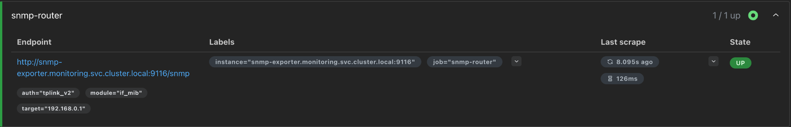
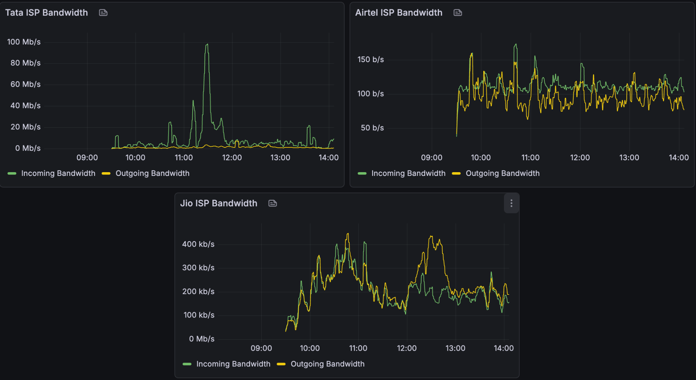
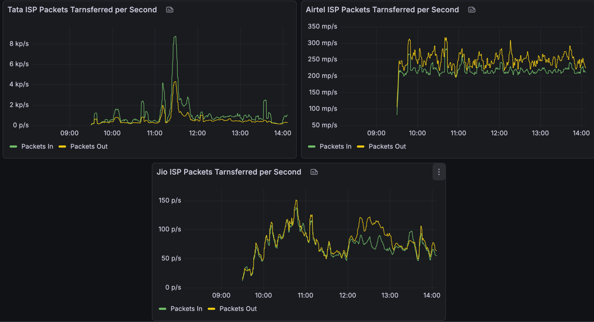
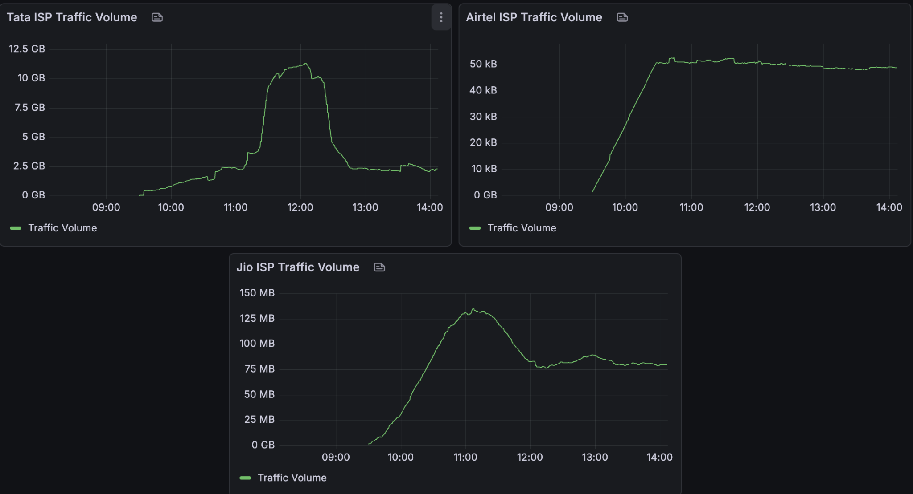
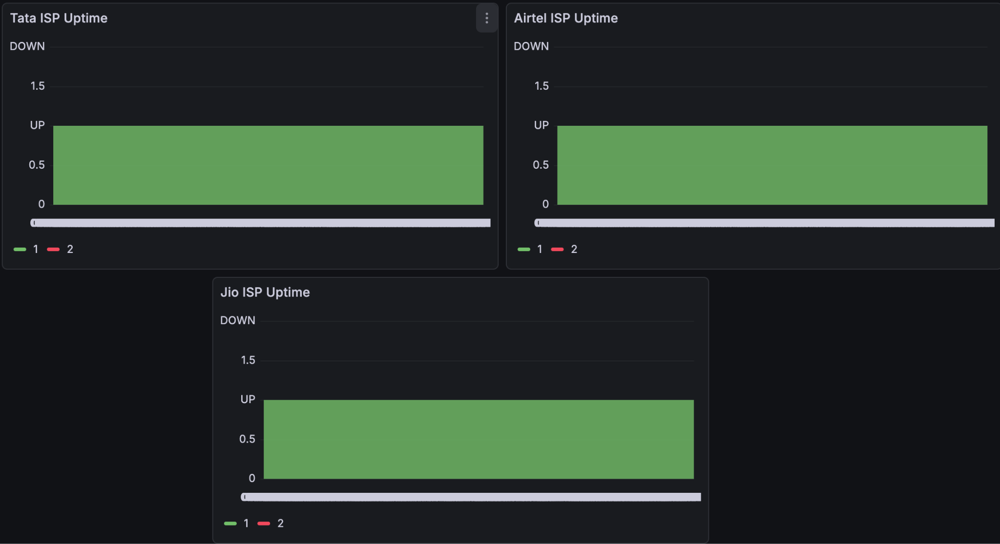

# SNMP Based ISP Monitoring

## Introduction

This approach follows ISP network monitoring using SNMP to collect real-time device metrics.

The router exposes performance and status data via SNMP, which is scraped by an SNMP Exporter running inside a Kubernetes pod and converted into a Prometheus-compatible format.

Prometheus then collects and stores these metrics.

Finally, Grafana visualizes the data through dashboards, providing clear insights into network bandwidth, performance, and availability for the ISPs in the network.

## Workflow

```text
Router (192.168.0.1)
        ↓ SNMP
SNMP Exporter (Kubernetes Pod)
        ↓ /metrics
Prometheus (Kubernetes Pod)
        ↓ PromQL
Grafana (Kubernetes Pod)
        ↓ Dashboard
Network Monitoring
```

---

# Procedure

## Step 1 - Create Monitoring Namespace

Create a dedicated namespace for all monitoring components.

```bash
sudo k8s kubectl create namespace monitoring
```

Verify the namespace with:

```bash
sudo k8s kubectl get ns
```

Ensure the `monitoring` namespace is listed.


---

## Step 2 - Deploy SNMP Exporter (Custom Configuration)

We do not use Helm for SNMP Exporter.

Because a custom `snmp.yml` is already configured that includes:

- Custom module: `tplink_v2`
- SNMP community string

This config will be mounted into Kubernetes using a ConfigMap.

**Custom `snmp.yml` - Click Here**

---

## Step 3 - Create a ConfigMap

Create a ConfigMap from the `snmp.yml` file.

```bash
sudo k8s kubectl create configmap snmp-config --from-file=snmp.yml -n monitoring
```

Verify with:

```bash
sudo k8s kubectl get configmap -n monitoring
```


---

## Step 4 - Deploy SNMP Exporter

Create an `snmp-exporter.yaml` with the following configuration.

```yaml
apiVersion: apps/v1
kind: Deployment
metadata:
  name: snmp-exporter
  namespace: monitoring
spec:
  replicas: 1
  selector:
    matchLabels:
      app: snmp-exporter
  template:
    metadata:
      labels:
        app: snmp-exporter
    spec:
      containers:
        - name: snmp-exporter
          image: prom/snmp-exporter:v0.25.0
          ports:
            - containerPort: 9116
          volumeMounts:
            - name: config-volume
              mountPath: /etc/snmp_exporter
      volumes:
        - name: config-volume
          configMap:
            name: snmp-config
---
apiVersion: v1
kind: Service
metadata:
  name: snmp-exporter
  namespace: monitoring
spec:
  selector:
    app: snmp-exporter
  ports:
    - port: 9116
      targetPort: 9116
  type: NodePort
```

Apply deployment:

```bash
sudo k8s kubectl apply -f snmp-exporter.yaml
```

Verify pods with:

```bash
sudo k8s kubectl get pods -n monitoring
```

You should see your `snmp-exporter` pod in the **Running** state.

Look into the NodePort assigned to your SNMP Exporter service with:

```bash
sudo k8s kubectl get svc -n monitoring
```

Access your SNMP Exporter with the following to see the SNMP Raw Metrics.

```text
http://<server-ip>:<NodePort>/snmp?module=if_mib&target=192.168.0.1&auth=tplink_v2
```


---

## Step 5 - Install Prometheus

Add and update the Prometheus Helm repository.

```bash
helm repo add prometheus-community https://prometheus-community.github.io/helm-charts

helm repo update
```

Deploy Prometheus into the monitoring namespace.

```bash
helm install prometheus prometheus-community/prometheus \
 --namespace monitoring
```

Wait for approximately **1–2 minutes** for all components to initialize.

Check the Prometheus components with:

```bash
sudo k8s kubectl get pods -n monitoring
```


Since external access is required, enable **NodePort** Service to Prometheus.

Edit Service:

```bash
sudo k8s kubectl edit svc prometheus-server -n monitoring
```

Modify the Service type from **ClusterIP** to **NodePort**.

```yaml
type: NodePort
```

Access Prometheus UI from:

```text
http://<SERVER-IP>:<NodePort>
```

---

## Step 6 - Configure SNMP Scraping in Prometheus

By default, Prometheus does not scrape SNMP data. We must explicitly add a scrape job.

Edit Prometheus ConfigMap.

```bash
sudo k8s kubectl edit configmap prometheus-server -n monitoring
```

Locate `scrape_configs:` and add the following.

```yaml
- job_name: 'snmp-router'
  metrics_path: /snmp
  params:
    module: [if_mib]
    auth: [tplink_v2]
    target: [192.168.0.1]
  static_configs:
    - targets:
      - snmp-exporter.monitoring.svc.cluster.local:9116
```

Ensure proper indentation and matches the existing YAML structure.

Apply changes by restarting the Prometheus pod.

```bash
sudo k8s kubectl delete pod <prometheus-server-pod> -n monitoring
```

or

```bash
sudo k8s kubectl delete pod -n monitoring -l app.kubernetes.io/name=prometheus
```

The pod will auto-recreate.

Now open Prometheus UI and locate the Targets.

Navigate to:

```text
Status → Targets
```

You should see **snmp-router** target **UP**.

This ensures that the SNMP Exporter integrated as a scrape target and the router metrics are now being collected.



---

## Step 7 - Grafana Integration

Add Grafana Helm repository.

```bash
helm repo add grafana https://grafana.github.io/helm-charts
helm repo update
```

Create a `grafana-values.yaml` configuration file.

```yaml
service:
  type: NodePort
  nodePort: 32381

adminUser: admin
adminPassword: admin

persistence:
  enabled: true
  size: 5Gi

datasources:
  datasources.yaml:
    apiVersion: 1
    datasources:
      - name: Prometheus
        type: prometheus
        access: proxy
        url: http://prometheus-server.monitoring.svc.cluster.local
        isDefault: true
```

Install Grafana with:

```bash
helm install grafana grafana/grafana \
-n monitoring -f grafana-values.yaml
```

Verify deployment with:

```bash
sudo k8s kubectl get pods -n monitoring
```

Access Grafana with:

```text
http://<SERVER-IP>:<NodePort>
```

Log in with the configured credentials.


---

## ISP Interface Mapping

Before you create ISP Dashboards, you would need to identify ISP interfaces from your router.

For our Network we have:

| ISP | Interface Name |
|------|----------------|
| X | default/eth1 |
| Y | default/inf.4092 |
| Z | default/inf.4093 |

---

## Step 8 - Create Grafana Dashboards

Use the following PromQL queries to create graphical visualizations.

### Panel 1 — Bandwidth per ISP

```promql
rate(ifHCInOctets{ifDescr="default/eth1"}[5m]) * 8 / 1024 / 1024
```

**Unit:** Megabits per second (Mbps)



---

### Panel 2 — Packets per ISP

```promql
rate(ifInUcastPkts{ifDescr="default/eth1"}[5m])
```

**Unit:** Packets/sec



---

### Panel 3 — Traffic Volume

```promql
increase(ifHCInOctets{ifDescr="default/eth1"}[1h]) / 1024 / 1024 / 1024
```

**Unit:** Gigabytes (GB)



---

### Panel 4 — Interface Status (Uptime)

```promql
ifOperStatus{ifDescr="default/eth1"}
```

